# Architektura systemu — Magic Diary

## Przegląd systemu

Magic Diary to mobilna aplikacja webowa (SPA) w stylu Harry'ego Pottera, która pozwala użytkownikom prowadzić prywatny dziennik z opcją rozmowy z AI w roli Severusa Snape'a. Każdy wpis ma tekst sformatowany przez edytor rich-text, nastrój w skali 1–5 oraz opcjonalne zdjęcia. Kluczową cechą systemu jest **hybrydowe wyszukiwanie semantyczne** — wpisy są wektoryzowane przez OpenAI (`text-embedding-3-small`) i przechowywane w pgvector; podczas rozmowy AI przeszukuje historię łącząc ANN (wektory), full-text i zawsze dołącza ostatnie 7 dni dziennika. System udostępnia też zewnętrzne API REST (v1) oraz serwer MCP (JSON-RPC 2.0), dzięki którym asystenci zewnętrzni (np. Claude Code) mogą zapisywać wpisy i pytać Snape'a w imieniu zalogowanego użytkownika.

---

## Diagram architektury

```mermaid
flowchart TD
    subgraph Klient ["Przeglądarka (React SPA)"]
        UI["Komponenty UI\n(App, Sidebar, EntryEditor,\nCharacterChatOverlay…)"]
        SUPABASE_SDK["@supabase/supabase-js\n(anon key, RLS)"]
        LOCALSTORAGE["localStorage\n(cache profilu, ulubione)"]
    end

    subgraph Next["Next.js 14 — App Router (Vercel Edge/Node)"]
        CHAT["POST /api/chat\n(streaming AI chat)"]
        MCP["GET/POST /api/mcp\n(JSON-RPC 2.0)"]
        V1_ENTRIES["POST /api/v1/entries\n(REST: nowy wpis)"]
        V1_EMBEDDINGS["POST /api/v1/embeddings\n(backfill embeddings)"]
        V1_ASK["POST /api/v1/ask\n(REST: zapytaj Snape'a)"]
    end

    subgraph Supabase ["Supabase (eu-north-1, Postgres 17)"]
        DB["Tabele\n• entries (+ kolumna embedding vector)\n• chat_messages\n• notes / progress / resources (nieużywane)"]
        AUTH["Supabase Auth\n(email+password, user_metadata)"]
        STORAGE["Storage bucket\nentry-photos"]
        RPC["RPC: hybrid_search_entries\n(pgvector ANN + full-text)"]
    end

    subgraph External ["Zewnętrzne API"]
        XAI["xAI API\ngrok-4.3\n(generacja tekstu / streaming)"]
        OPENAI["OpenAI API\ntext-embedding-3-small\n(wektory 1536-dim)"]
    end

    subgraph MCPClients ["Klienci MCP / zewnętrzni"]
        CLAUDE_CODE["Claude Code\n(/add-magic-diary-entry skill)"]
        OTHER_MCP["Inne klienty MCP\n(HTTP Bearer token)"]
    end

    %% Klient ↔ Supabase (bezpośrednio)
    UI -- "auth, CRUD entries\nchat_messages, storage" --> SUPABASE_SDK
    SUPABASE_SDK -- "REST/Realtime + RLS" --> DB
    SUPABASE_SDK -- "upload/signed URL" --> STORAGE
    SUPABASE_SDK -- "signIn / getUser" --> AUTH

    %% Klient ↔ Next.js API
    UI -- "stream: POST /api/chat\nBearer accessToken" --> CHAT
    UI -- "POST /api/v1/embeddings\n(trigger po zapisie)" --> V1_EMBEDDINGS

    %% Next.js API ↔ Supabase
    CHAT -- "createUserClient(token)\nentries SELECT / RPC" --> DB
    V1_ENTRIES -- "INSERT entry\nupdate embedding" --> DB
    V1_ASK -- "SELECT entry\nRPC hybrid_search" --> DB
    MCP -- "INSERT / SELECT / RPC" --> DB

    %% Next.js API ↔ AI
    CHAT -- "streamText (xai grok-4.3)" --> XAI
    V1_ASK -- "generateText (xai grok-4.3)" --> XAI
    MCP -- "generateText (xai grok-4.3)" --> XAI
    V1_EMBEDDINGS -- "POST /v1/embeddings" --> OPENAI
    V1_ENTRIES -- "generateEmbedding (async)" --> OPENAI

    %% Zewnętrzni klienci
    CLAUDE_CODE -- "execute_sql przez Supabase MCP" --> DB
    OTHER_MCP -- "POST /api/mcp\nBearer token" --> MCP

    %% Profil / cache
    UI -- "cache (username, house, defaultAgent)" --> LOCALSTORAGE
    AUTH -- "user_metadata (profil)" --> SUPABASE_SDK
```



---

## Komponenty

### Frontend (React / Next.js)

| Komponent | Plik | Odpowiedzialność |
|-----------|------|-----------------|
| **App** | `components/App.tsx` | Główny orchestrator — routing widoków (splash, new, entries, view, edit), zarządzanie stanem sesji i wpisów, obliczanie streak/topMood |
| **AuthScreen** | `components/AuthScreen.tsx` | Formularz logowania/rejestracji via Supabase Auth |
| **Onboarding** | `components/Onboarding.tsx` | Pierwsze uruchomienie — wybór nazwy użytkownika i domu Hogwartu; zapisuje do `user_metadata` |
| **Sidebar** | `components/Sidebar.tsx` | Panel boczny: lista wpisów, nawigacja, profil, ustawienia, statystyki |
| **EntryEditor** | `components/EntryEditor.tsx` | Edytor rich-text TipTap (HTML), wybór nastroju (MoodPicker), upload zdjęć |
| **EntryView** | `components/EntryView.tsx` | Widok wpisu, przyciski ulubionych, przejście do chatu |
| **EntriesList** | `components/EntriesList.tsx` | Lista wpisów z kalendarzem tygodniowym (WeekCalendar) |
| **CharacterChatOverlay** | `components/CharacterChatOverlay.tsx` | Overlay rozmowy z AI (streaming) |
| **PostacieOverlay** | `components/PostacieOverlay.tsx` | Wybór postaci AI (Snape / Hedwiga) |
| **SplashScreen** | `components/SplashScreen.tsx` | Animowany ekran startowy |
| **BottomNav** | `components/BottomNav.tsx` | Dolna nawigacja mobilna |
| **Toast** | `components/Toast.tsx` | System powiadomień toast |

### Biblioteki pomocnicze (`lib/`)

| Moduł | Odpowiedzialność |
|-------|-----------------|
| `supabase.ts` | Klient Supabase (anon key) — używany po stronie klienta |
| `supabase-admin.ts` | `createUserClient(token)` — klient server-side z Bearer tokenem użytkownika |
| `storage.ts` | CRUD wpisów (`entries`), wiadomości chatu (`chat_messages`) |
| `embeddings.ts` | Generowanie wektorów via OpenAI `text-embedding-3-small` |
| `hybrid-search.ts` | Hybrid search: pgvector ANN + fallback keyword + ostatnie 7 dni |
| `profile.ts` | Profil użytkownika (username, house) w `user_metadata`; cache w localStorage |
| `entry-photos.ts` | Upload/usuwanie/signed URLs dla zdjęć (bucket `entry-photos`) |
| `favorites.ts` | Ulubione wpisy — przechowywane wyłącznie w localStorage |
| `houseTheme.ts` | System motywów wizualnych per dom Hogwartu (4 palety) |
| `rate-limit.ts` | In-memory rate limiter (best-effort, per userId, 20 req/min) |
| `validate.ts` | Walidacja formatu daty `YYYY-MM-DD` |
| `toast.ts` | Globalny emitter powiadomień toast |
| `dates.ts` | Polskojęzyczne etykiety dat: `shortDate` ("11 cze 2026"), `fullDate` ("Środa, 11 czerwca 2026"), `relativeDate` ("Dziś" / "Wczoraj" / "3 dni temu") |

### API Routes (Next.js App Router)

| Endpoint | Metoda | Opis |
|----------|--------|------|
| `/api/chat` | POST | Strumieniowy chat z AI (xAI grok-4.3). Wymaga auth tokenu. Rate limit 20/min. Persona: Snape lub Hedwiga. Tool: `search_diary` (hybrid search). |
| `/api/v1/entries` | POST | REST: utwórz wpis (auth wymagana). Po zapisie asynchronicznie generuje embedding. |
| `/api/v1/entries/[date]` | GET | REST: pobierz wpis dla konkretnej daty (ostatni po `created_at`). Zwraca 404 gdy brak wpisu. |
| `/api/v1/embeddings` | POST | Backfill/generowanie embeddingów dla wpisów bez wektora. Przyjmuje opcjonalne `{ id }` dla pojedynczego wpisu. |
| `/api/v1/ask` | POST | REST: jednorazowe zapytanie do Snape'a (nie-streaming). Używa `generateText` + `hybridSearch`. |
| `/api/mcp` | GET | Informacje o serwerze MCP (discovery). |
| `/api/mcp` | POST | Serwer MCP (JSON-RPC 2.0). Metody: `initialize`, `tools/list`, `tools/call`. |

---

## Źródła danych

### Supabase Postgres (eu-north-1)

| Tabela | Zawartość | Dostęp |
|--------|-----------|--------|
| `entries` | Wpisy dziennika: `id, title, content (HTML), mood (1-5), date, photos (text[]), embedding (vector), user_id, created_at, updated_at` | RLS: `auth.uid() = user_id` |
| `chat_messages` | Historia rozmów z AI: `id, entry_id, user_id, role, text, created_at` | RLS: `auth.uid() = user_id` |
| `notes`, `progress`, `resources` | Nieużywane tabele (prawdopodobnie z wcześniejszego prototypu) | — |

**Funkcja RPC:** `hybrid_search_entries(query_embedding, query_text, match_count)` — łączy przeszukiwanie ANN (pgvector) z full-text search, zwraca do 30 wpisów posortowanych wg relevance.

### Supabase Storage

Bucket `entry-photos` — zdjęcia powiązane z wpisami. Ścieżka: `{userId}/{date}/{uuid}.{ext}`. Dostęp przez signed URLs (TTL 3600s).

### localStorage (przeglądarka)

- Profil użytkownika (cache dla instant first paint): `magic_diary_username`, `magic_diary_house`, `magic_diary_onboarding_done`, `magic_diary_default_agent`
- Ulubione wpisy: `magic_diary_favorites` (tablica ID)

Autorytywnym źródłem profilu jest `user_metadata` w Supabase Auth — localStorage jest tylko cache'em.

---

## Integracje i połączenia

| Integracja | Kierunek | Autentykacja | Uwagi |
|-----------|----------|--------------|-------|
| **Supabase Auth** | klient ↔ Supabase | Sesja JWT (anon key + access token) | email+password; token przekazywany do API routes jako Bearer |
| **xAI API (`api.x.ai`)** | server → xAI | `XAI_API_KEY` (env) | Model `grok-4.3`; streaming (`streamText`) i jednorazowy (`generateText`); max 350 tokenów wyjściowych |
| **OpenAI API** | server → OpenAI | `OPENAI_API_KEY` (env) | Model `text-embedding-3-small`; 1536-wymiarowe wektory; używany tylko do generowania embeddingów |
| **Supabase Storage** | klient ↔ Supabase | Sesja JWT | Bucket `entry-photos`; upload bezpośrednio z przeglądarki |
| **MCP server (`/api/mcp`)** | zewnętrzny klient → Next.js | Bearer token użytkownika | JSON-RPC 2.0; narzędzia: `add_diary_entry`, `get_diary_entry`, `ask_snape` |
| **Supabase MCP** (zewnętrzny) | Claude Code → Supabase | Klucz serwisowy Supabase MCP | Skill `/add-magic-diary-entry` używa `execute_sql` przez MCP, omijając API aplikacji |
| **Google Fonts** | klient → Google | brak | Tylko w CSP allowlist (`fonts.googleapis.com`, `fonts.gstatic.com`) |

---

## Przepływ danych

### 1. Logowanie

```
Przeglądarka → Supabase Auth (email+password)
             ← JWT access_token + user_metadata (profil)
             → localStorage (cache profilu)
```

### 2. Odczyt wpisów

```
App.tsx → supabase.from('entries').select() [RLS: tylko własne]
        ← lista wpisów (HTML content, mood, photos[])
        → localStorage (favorites overlay)
```

### 3. Zapis nowego wpisu

```
EntryEditor → supabase.from('entries').insert()
            ← entry.id
            → triggerEmbedding(id) [fire-and-forget]
                └→ POST /api/v1/embeddings { id }
                   └→ OpenAI text-embedding-3-small
                   └→ supabase.from('entries').update({ embedding })
```

### 4. Chat z AI (streaming)

```
CharacterChatOverlay → POST /api/chat
  [server]
  1. Weryfikacja Bearer token → Supabase Auth
  2. Rate limit check (in-memory)
  3. Budowanie system prompt (persona Snape/Hedwiga + bieżący wpis + ostatnie 7 dni)
  4. streamText(xai grok-4.3)
     └→ tool call: search_diary(query)
        └→ hybridSearch → Supabase RPC hybrid_search_entries
           (embedding via OpenAI → pgvector ANN + fallback keyword)
        ← pasujące wpisy (do 30)
     └→ kolejny krok (max 3 kroki agentyczne)
  5. Text stream → klient
  [klient]
  6. Wyświetlanie streamu + zapis do chat_messages (Supabase)
```

### 5. MCP (zewnętrzny asystent)

```
Klient MCP → POST /api/mcp { jsonrpc, method: "tools/call", params: { name, arguments } }
  [server]
  1. Bearer token → Supabase Auth
  2. Wywołanie handleToolCall:
     - add_diary_entry → INSERT entries
     - get_diary_entry → SELECT entries WHERE date=X
     - ask_snape → generateText(xai) + hybridSearch
  ← { jsonrpc, result: { content: [{ type: "text", text }] } }
```

---

## Hosting i deployment

| Element | Wartość |
|---------|---------|
| **Platforma** | Vercel (serverless, Edge Runtime) |
| **Live URL** | `https://magic-diary-blush.vercel.app` |
| **Repo** | `micleo22-glitch/magic-diary` (GitHub, prywatne) |
| **Auto-deploy** | Każdy push do gałęzi `main` → Production |
| **Ochrona** | Vercel Deployment Protection wyłączone (intencjonalnie — publiczna aplikacja; ochrona danych przez Supabase Auth + RLS) |
| **Baza danych** | Supabase, region `eu-north-1`, Postgres 17 |
| **Dev lokalny** | `npm run dev` → `localhost:3000` (via `launch.json` lub `start.bat`) |
| **Env vars (prod)** | `NEXT_PUBLIC_SUPABASE_URL`, `NEXT_PUBLIC_SUPABASE_ANON_KEY`, `XAI_API_KEY`, `OPENAI_API_KEY` |
| **Env vars (dev only)** | `NODE_TLS_REJECT_UNAUTHORIZED=0` (`.env.local`, NIE na Vercel) |

Nagłówki bezpieczeństwa HTTP skonfigurowane w `next.config.js`: `X-Frame-Options: DENY`, `HSTS`, `CSP` (allowlist dla Supabase i xAI), `Permissions-Policy`.

---

## Bezpieczeństwo — potwierdzony stan (2026-06-15)

- **RLS włączone** na wszystkich tabelach: `entries`, `chat_messages`, `notes`, `progress`, `resources` — potwierdzone zapytaniem do `pg_tables`. Każdy użytkownik widzi tylko własne dane.
- **Klucze API nie są w repozytorium** — `.env.local` jest w `.gitignore` i nigdy nie był commitowany (sprawdzone przez `git log`). Klucze `XAI_API_KEY` i `OPENAI_API_KEY` żyją wyłącznie w Vercel env vars i lokalnym `.env.local`.
- **GitHub public — bezpieczne** — upublicznienie repo nie wycieka kluczy API (nie ma ich w kodzie). Eksponuje jedynie kod źródłowy i system prompty Snape'a.
- **Vercel Deployment Protection wyłączone** — intencjonalnie, bo to publiczna aplikacja. Prawdziwa ochrona danych to Supabase Auth + RLS.

## Otwarte pytania / TODO

- **Rate limiting** — obecna implementacja jest in-memory i per-instancja Vercel Lambda. Przy dużym ruchu nie jest efektywna między równoległymi instancjami. Komentarz w kodzie wskazuje na plany migracji do Upstash/Redis.
- **Tabele `notes`, `progress`, `resources`** — istnieją w Supabase (RLS włączone) ale nie są używane przez żaden kod aplikacji. Pozostałość po wcześniejszym prototypie — do rozważenia usunięcie.
- **Hedwiga** — postać dostępna w selektorze, system prompt to wyłącznie `hu huu huuuu`. Nie wiadomo czy planowane jest rozszerzenie roli tej postaci.
- **Tygodniowe katalogi (`week-1`–`week-5`)** — usunięte z dysku i z gita (2026-06-15). Historia commitów nadal dostępna przez `git log`.
